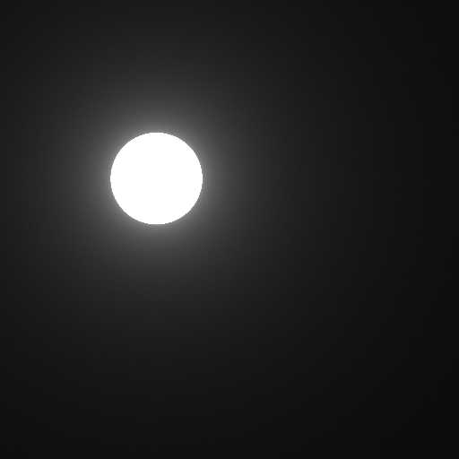
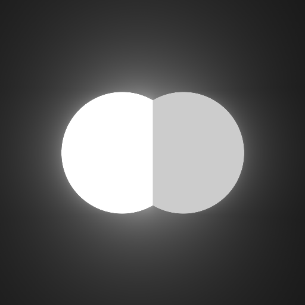
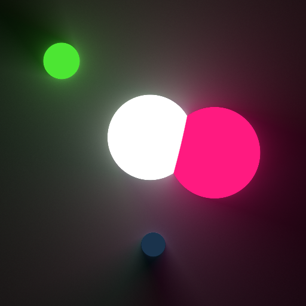
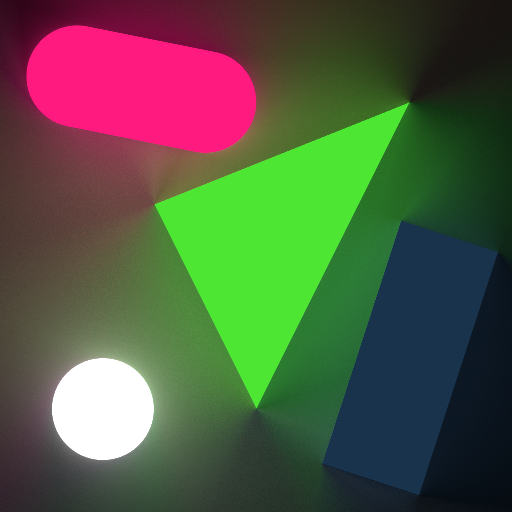

# light2d_cuda

CUDA implementation of [miloyip/light2d](https://github.com/miloyip/light2d).

Interaction and progressive rendering supported.

# Results

* basic

* basic_interactive

* csg

* csg_interactive

* shapes

* shapes_interactive

